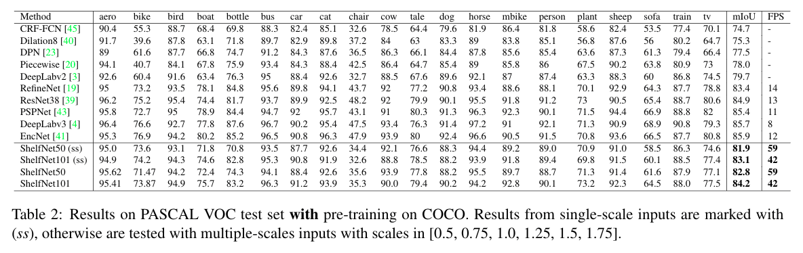

# ShelfNet 
* [Link to project page](https://github.com/juntang-zhuang/ShelfNet/)
* [Link to my homepage](https://juntangzhuang.com)
* This is repository for my paper [ShelfNet for real-time semantic segmentation](https://arxiv.org/abs/1811.11254), and avhieves both faster inference speed and higher segmentation accuracy, compared with other real-time models such as Lightweight-RefineNet.
* This implementation is based on [torch-encoding](https://github.com/zhanghang1989/PyTorch-Encoding). Main difference is the structure of the model. </br></br>
**Results**</br>
* We tested ShelfNet with ResNet50 and ResNet101 as the backbone respectively: they achieved **59 FPS** and **42 FPS** respectively on a GTX 1080Ti GPU with a 512x512 input image. 
* On PASCAL VOC 2012 test set, it achieved **84.2%** mIoU with ResNet101 backbone and **82.8%** mIoU with ResNet50 backbone.
* It achieved **75.8%** mIoU with ResNet50 backbone on Cityscapes dataset.

# Requirements
* Please refer to [torch-encoding](https://github.com/zhanghang1989/PyTorch-Encoding) for implementation on synchronized batch-normalization layer.
* PyTorch 0.4.1 (Please install with pip not conda)
* Python 3.6
* requests
* nose
* scipy
* tqdm
* Other requirements by [torch-encoding](https://github.com/zhanghang1989/PyTorch-Encoding).

# How to run
**Environment setup and data preparation**
* run ```python setup.py install``` to install torch-encoding
* make sure you have the same path for a datset in ```/scripts/prepare_xx.py``` and ```/encoding/datasets/xxx.py```, default path is ```~/.encoding/data```, which is a hidden folder. You will need to type ```Ctrl + h``` to show is in ```Files```
* run ```cd scripts```
* run ```python prepared_xx.py ``` to prepare datasets, including MS COCO, PASCAL VOC, PASCAL Aug, PASCAL Context 
* Download test dataset from official evaluation server for PASCAL, extract and merge with training data folder, e.g. ```~/.encoding/data/VOCdevkit``` </br>

**Configurations** (refer to /experiments/option.py)</br>
* --model: which model to use, default is ```shelfnet```, other options include ```pspnet```, ```encnet```,```fcn```
* --backbone: backbone of the model, ```resnet50``` or ```resnet101```
* --dataset: which dataset to train on, ```coco``` for MS COCO, ```pascal_aug``` for augmented PASCAL,```pascal_voc``` for PASCAL VOC,```pcontext``` for pascal context.
* --aux: if type ```--aux```, the model will use auxilliray layer, which is a FCN head based on the final block of backbone.
* --se_loss: a context module based on final block of backbone, the shape is 1xm where m is number of categories. It penalizes whether a category is present or not.
* --resume: default is None. It specifies the checkpoint to load
* --ft: fine tune flag. If set as True, the code will resume from checkpoint but forget previous best accuracy and optimizer information.
* --checkname: folder name to store trained weights
* Other parameters are trevial, please refer to /experiments/segmentation/option.py for more details

**Training scripts**
* run ```cd /experiments/segmentation```
* pre-train ShelfNet50 on COCO, </br>
```python train.py --backbone resnet50 --dataset coco --aux --se-loss --checkname ShelfNet50_aux```
* fine-tune ShelfNet50 on PASCAL_aug, you may need to double check the path for resume.</br>
```python train.py --backbone resnet50 --dataset pascal_aug --aux --se-loss --checkname ShelfNet50_aux --resume ./runs/coco/shelfnet/ShelfNet50_aux_se/model_best.pth.tar -ft```
* fine-tune ShelfNet50 on PASCAL VOC, you may need to double check the path for resume.</br>
```python train.py --backbone resnet50 --dataset pascal_voc --aux --se-loss --checkname ShelfNet50_aux --resume ./runs/pascal_aug/shelfnet/ShelfNet50_aux_se/model_best.pth.tar -ft```

**Test scripts**
* To test on PASCAL_VOC with multiple-scales input \[0.5, 0.75, 1.0, 1.25, 1.5, 1.75\].</br>
```python test.py --backbone resnet50 --dataset pascal_voc --resume ./runs/pascal_voc/shelfnet/ShelfNet50_aux_se/model_best.pth.tar```
* To test on PASCAL_VOC with single-scale input</br>
```python test_single_scale.py --backbone resnet50 --dataset pascal_voc --resume ./runs/pascal_voc/shelfnet/ShelfNet50_aux_se/model_best.pth.tar```
* Similar experiments can be performed on ShelfNet with ResNet101 backbone

**Evaluation scripts**
* You can use the following script to generate ground truth - prediction pairs on PASCAL VOC validation set. </br>
```python evaluate_and_save.py --backbone resnet50 --dataset pascal_voc --resume ./runs/pascal_voc/shelfnet/ShelfNet50_aux_se/model_best.pth.tar --eval```

**Measure running speed**
* Measure running speed of ShelfNet on 512x512 image. </br>
```python test_speed.py --model shelfnet --backbone resnet101```</br>
```python test_speed.py --model pspnet --backbone resnet101```</br>

**Pre-trained weights**
* [Link to weights trained on PASCAL](https://drive.google.com/drive/folders/1k23TpBDsP9_gnb3LZlEcYyF4yoVzW99Z?usp=sharing)

# Structure of ShelfNet
 </br>


# Examples on Pascal VOC datasets
 </br>
# Video Demo on Cityscapes datasets
**Video demo of ShelfNet50 on Cityscapes**
<a href="url"></a> </br>
**Video demo of ShelfNet101 on Cityscapes** </br>
<a href="url"></a> </br>
</br></br>
# Numerical results on Pascal VOC

